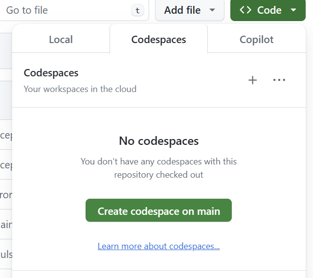
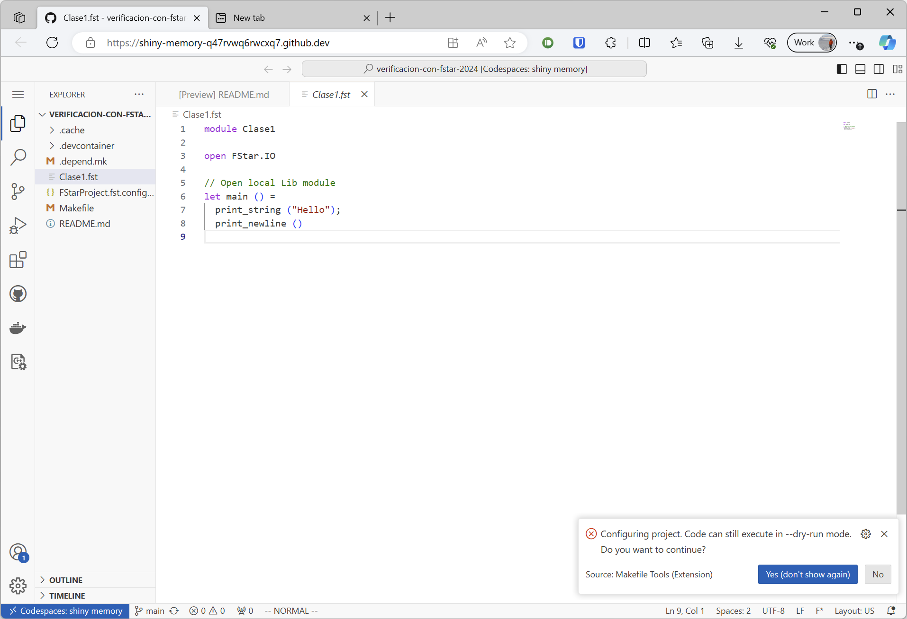
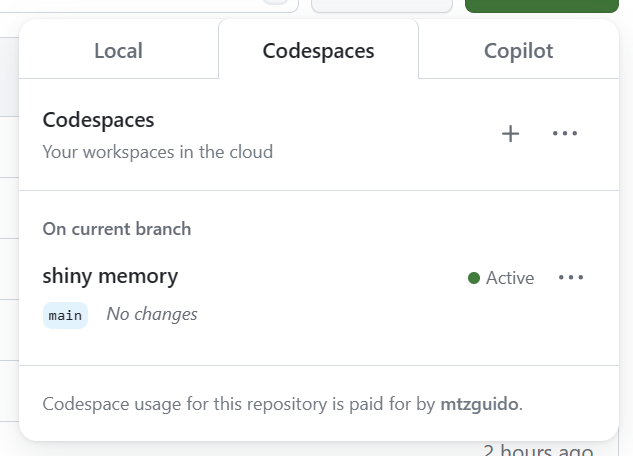

Hay varias opciones para ejecutar F\* y seguir la materia.

La opción más fácil para arrancar es usar la instalación existente
en labdcc. El único problema es que puede ser un poco lento y/o no
estar disponible. Llegado a ese caso la opción 2 es conveniente.

Opción 1 - En labdcc
====================

Si no tenés usuario de `labdcc` pedile uno a Juan Ignacio Farizano.

Paso 1.1 - Poner fstar.exe en el PATH
-------------------------------------

Ya hay una instalación de F\* y Z3 en el sistema. Para agregar F\* al
`$PATH`, agregá la siguiente línea al fondo del archivo `.profile` en
tu home (no cambiar el nombre de usuario):

    export PATH="$PATH:/home/gmartinez/.binarios-fstar"

Luego, reconectate a labdcc y corré `fstar.exe` para confirmar que
ejecuta correctamente.

Paso 1.2 - VS Code con SSH
--------------------------

Desde tu máquina local, con el SO que tenga, instalá VS Code. Desde VS Code,
elegí "Connect to Host" y escribí `labdcc.fceia.unr.edu.ar`, con tu usuario
y contraseña.

Lo más conveniente es preparar el ingreso sin contraseña (por clave
SSH). Seguir [esta guía](https://code.visualstudio.com/docs/remote/ssh)
para hacerlo.

Paso 1.3 - Instalar extensión
-----------------------------

Instalar la extensión `fstar-vscode-assistant` en VS Code, tanto local
como remoto.

Con todo esto hecho, al abrir un archivo F\* debería verse el coloreo
por sintaxis. Además, apretar `Ctrl+.` en el final del archivo debería
disparar la verificación y mostrar una línea verde a la izquierda del
buffer (si el archivo es correcto).

Opción 2 - Instalación nativa
=============================

Descargá el release
[v2024.01.13](https://github.com/FStarLang/FStar/releases/tag/v2024.01.1
3) de F\* correspondiente a tu sistema operativo. Esto incluye un
binario `fstar.exe`, un binario `z3`, entre otras cosas. Luego, agregá
el directorio `bin/` del release a tu `PATH`, de manera similar al paso
1.1 (pero en tu máquina local).

Instalá VS code localmente y seguí el paso 1.3. Con eso debería
quedar todo andando.

Opción 3 - GitHub codespaces (versión gratis: máximo 60 horas al mes)
=====================================================================

En este repositorio, clickear el botón `<>Code` y luego `Create
codespace on main`. Esto va a disparar la construcción de un
devcontainer con todo instalado en una VM de GitHub. (Para los curiosos:
la configuración del mismo está en `.devcontainer`.)

La construcción del container tarda bastante tiempo, cerca de **una
hora**.

Una vez construido, se va abrir una instancia de VS Code en el
navegador. La UI corre en el navegador, localmente, mientras que el
backend (incluyendo F\*, Z3, etc) corre en la VM de GitHub.

Esta instancia de VS Code debería tener la extensión para F\*
instalada desde el comienzo. Sin embargo es posible que haya que
reiniciar (actualizar con F5) para que se active.

Se puede cerrar la ventana, el codespace seguirá vivo. Se puede volver
a acceder desde la pestaña `<>Code`

Opción 4 - Compilar desde los fuentes
=====================================

No recomendado... pero los kamikazes pueden seguir las instrucciones de
`INSTALL.md` en el [repositorio de F\*](http://github.com/FStarLang/FStar).
